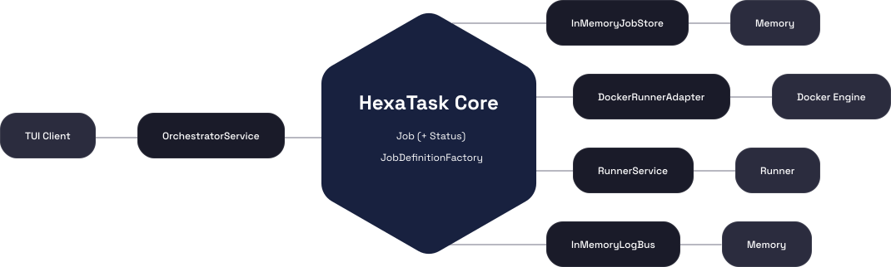
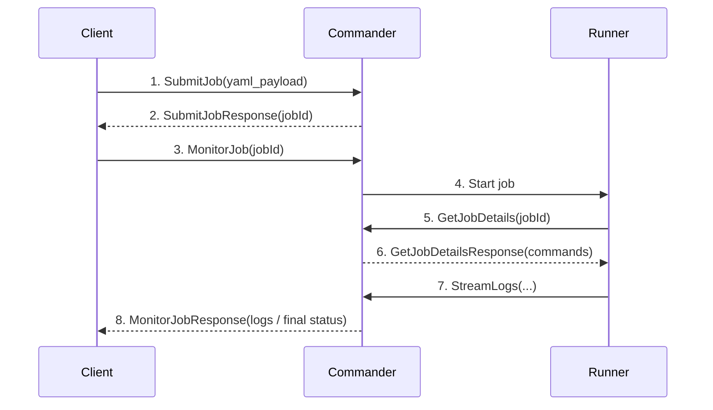

# HexaTask 

HexaTask is a task runner designed to execute shell commands securely within isolated docker container environments. HexaTask is built upon the Ports and Adapters (**Hexagonal**) Pattern.

<br>
<p align="center">
  
</p>
<br>

> [!NOTE]
> **Project Scope & Educational Intent:**
> This project is explicitly designed as an **architectural prototype** for the "Software Architecture 2026" course. There are no plans to expand HexaTask into a full-scale production product or to compete with established tools. 
>
> The primary goal is to demonstrate and master:
> * **Professional Distributed Design:** Handling communication between C#, Go, and Rust.
> * **Professional Architecture:** Keeping the core logic clean from infrastructure dependencies.
> * **Modern Interoperability:** Using gRPC as a strict contract between polyglot microservices.

## Setup

### Prerequisites

Make sure the following tools are installed locally:

* `curl`
* `make`
* Docker with Docker Compose support (`docker compose`)

You can verify the required tools with:

```bash
curl --version
make --version
docker compose version
```

### Start the project

The repository includes a `Makefile` and a `compose.yml` file, so the quickest way to start the project is:

```bash
curl -O https://raw.githubusercontent.com/Jakkoble/HexaTask/main/Makefile
curl -O https://raw.githubusercontent.com/Jakkoble/HexaTask/main/compose.yml
make start
```

This command will:

* create the `jobs/` directory if it does not exist
* generate a sample job file at `jobs/demo.yaml`
* pull the required Docker images
* start the `commander` service
* wait until the `commander` is available
* launch the `tui` container

## Communication Flow

The following diagram shows only the high-level communication flow between `client`, `commander`, and `runner`:


